<!-- Generated by GitHub Profile Agent Console. Edit profile.config.json, then run npm run generate. -->

  <picture>
    <source media="(max-width: 760px) and (prefers-color-scheme: dark)" srcset="./assets/hero/agent-console-a493a8e2-mobile-dark.svg">
    <source media="(max-width: 760px)" srcset="./assets/hero/agent-console-a493a8e2-mobile-light.svg">
    <source media="(prefers-color-scheme: dark)" srcset="./assets/hero/agent-console-a493a8e2-dark.svg">
    <source media="(prefers-color-scheme: light)" srcset="./assets/hero/agent-console-a493a8e2-light.svg">
    
  </picture>

  

## About Me

Computer Science student passionate about web development and machine learning.

Always open to collaboration on open-source web and AI projects.

## Current Focus

| Area | What I am exploring |
| --- | --- |
| **Machine Learning** | Focusing on classification algorithms like Random Forest, XGBoost, and SVM. |
| **Web Development** | Building responsive, modern web applications and user interfaces. |
| **Data Science** | Analyzing datasets, extracting insights, and building quantitative evaluation models. |

## Featured Work

| Project | Focus | Why it matters |
| --- | --- | --- |
| [**Coding Stress ML**](https://github.com/kangrvin/coding-stress-ml-studio) | ML & Stress Classification | An ML application evaluating Random Forest, XGBoost, and SVM algorithms to predict the impact of coding stress on student programming performance. |
| [**Suzuki Showroom**](https://github.com/kangrvin/showroom-mobil-suzuki) | Web Development & UI/UX | A modern web application designed for showcasing Suzuki vehicle models, features, and pricing. |

## Research Direction

I am focused on applying machine learning models and data analysis to build smart, scalable web applications.

## Tech Stack

`Python` · `Machine Learning` · `Web Development` · `MySQL` · `Node.js`

## Recent Activity

<!-- AUTO:ACTIVITY:START -->
- Sep 3, 2026: pushed 1 commit to [kangrvin/finance-management](https://github.com/kangrvin/finance-management).
- Sep 2, 2026: pushed 1 commit to [kangrvin/finance-management](https://github.com/kangrvin/finance-management).
- Sep 1, 2026: pushed 1 commit to [kangrvin/finance-management](https://github.com/kangrvin/finance-management).
- Sep 1, 2026: created a branch in [kangrvin/finance-management](https://github.com/kangrvin/finance-management).
<!-- AUTO:ACTIVITY:END -->

---

  Continuous learning, building, and sharing what I learn.

